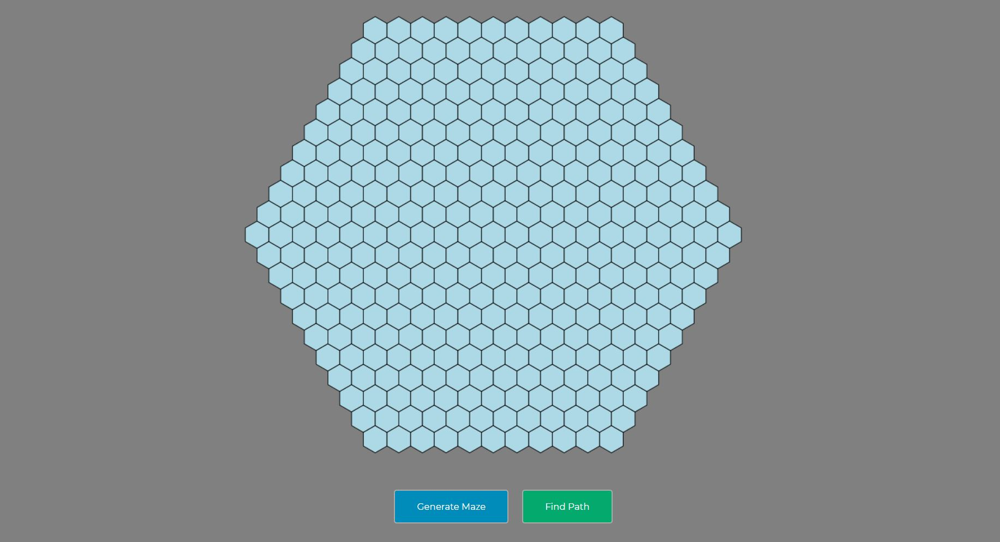
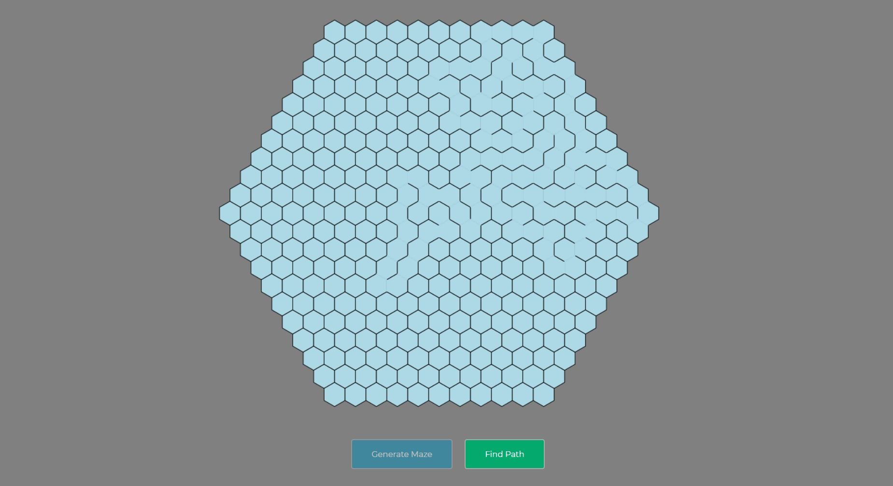
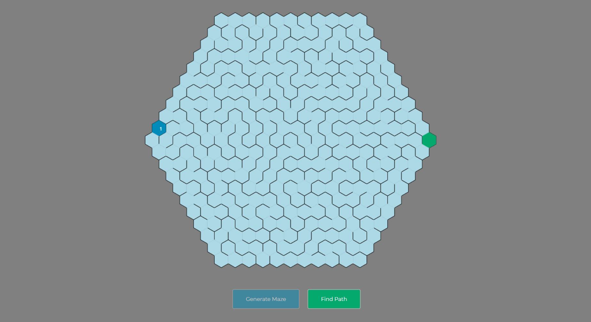
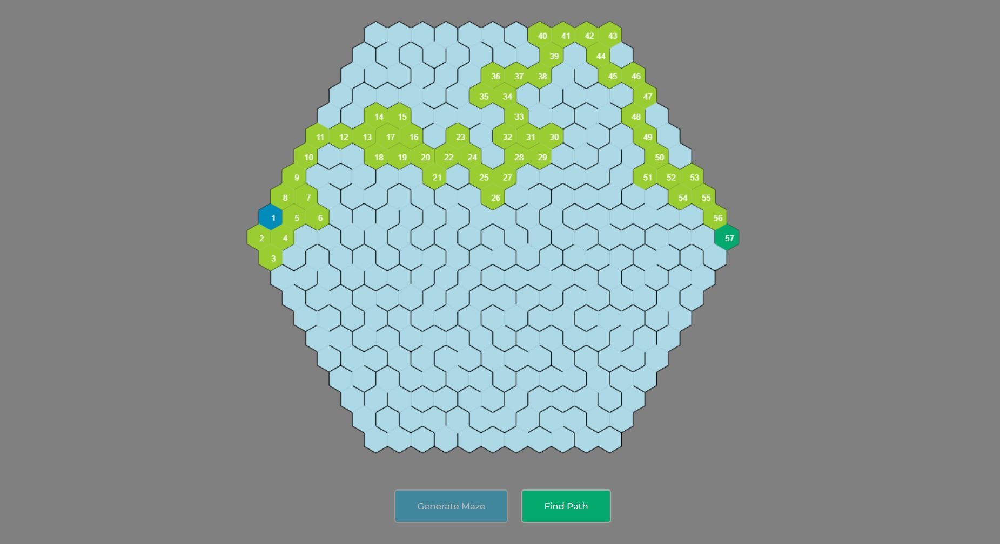

# A* Hexagonal Path Finder

I made this project with the intention of learing 3 things.
1. How to use hexagons and the math behind it when coding them.
2. How to generate a honeycomb maze.
3. How to implement A* algorithm to find a path between two points.

## How it works

1. Initial state


2. Maze generation state


3. Select two points


4. Final path found


## Hexagons and the Math behind it.

I am sure if you google it, you will find this amazing website made by Red Blob Game. (check it out [here](https://www.redblobgames.com/grids/hexagons/))

Most of the math related to this code is in pointy-top hexagon shape. All of the Math can be found in that website. If you want to understand what I used, please check out the [Geometry](https://www.redblobgames.com/grids/hexagons/#basics), [Coordinate systems](https://www.redblobgames.com/grids/hexagons/#coordinates), [Conversions](https://www.redblobgames.com/grids/hexagons/#conversions), [Neighbors](https://www.redblobgames.com/grids/hexagons/#neighbors), [Hex to pixel](https://www.redblobgames.com/grids/hexagons/#hex-to-pixel), and, [Pixel to hex](https://www.redblobgames.com/grids/hexagons/#pixel-to-hex) sections.

As for the coordinate systems, I went with the axial coordinates.

## Maze Generation

Arguably, this step took me the longest while doing this project because of the overlap between wall removing and hexagon math for it. I was confused most of the time but it worked out in this.

As for the algorithm, I made use of Randomized DFS (iterative implementation with stack) to create a guaranteed solvable maze. For this, I refered to the Wikipedia resource on [Maze Generation algorithms](https://en.wikipedia.org/wiki/Maze_generation_algorithm).

## A* Algorithm and Path Finding

Needless to say, there are many resources that explain the A* algorithm in detail so I am not going to explain how it work. However, if you want to understand what I did, please check out [this](https://www.datacamp.com/tutorial/a-star-algorithm) from DataCamp. Amazing, in detail explanation of A* algorithm with its psuedocode. I build the logic using the psuedocode provided there.

## How to run?

Just open up your favorite code editor with a terminal opened at the file location, and type: 
```
npm install
npm run start
```

## Future works, maybe?

If i want to revist this again, I will implement other path finding algorithms and maybe add more functionality and coloring. Feel free to take this code and make it better or whatever.